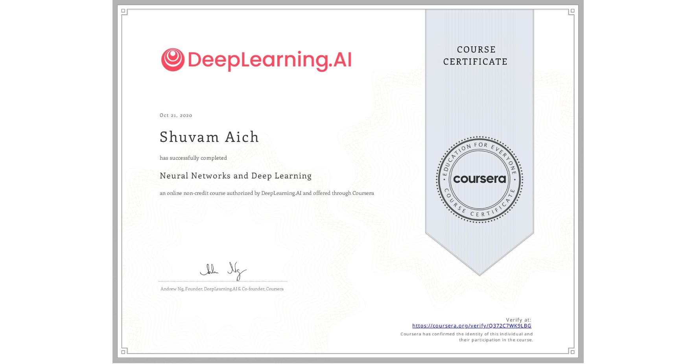

 
Shuvam successfully completed the Neural Networks and Deep Learning course by Andrew Ng on Coursera, a foundational program in deep learning and artificial intelligence. The course covered core concepts, including the basics of neural networks, forward and backward propagation, gradient descent, and optimization techniques. Through practical assignments, Shuvam gained hands-on experience in implementing neural networks and understanding their applications in computer vision, natural language processing, and other AI domains. This certification strengthened his understanding of deep learning fundamentals, laying a strong foundation for advanced AI research and development.

[Link to Certificate](https://www.coursera.org/account/accomplishments/verify/Q372C7WK9LBG)
