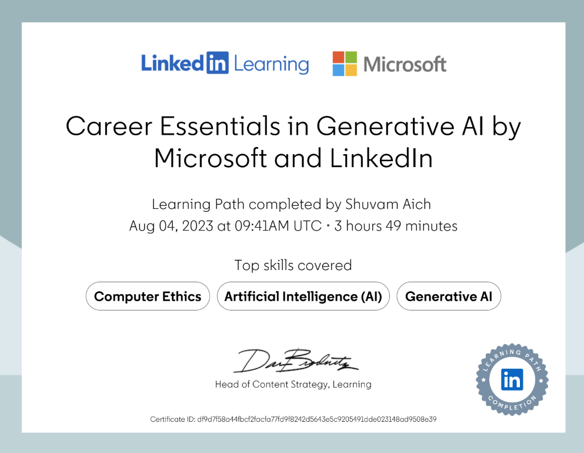

 
Shuvam completed the Career Essentials in Generative AI certification, offered by LinkedIn Learning in collaboration with Microsoft. This program provided him with a strong foundation in generative AI concepts, tools, and applications, emphasizing how these technologies are shaping industries and professional roles. The course covered topics such as AI-driven content creation, ethical considerations in AI, and leveraging generative models like GPT for business innovation. Through this certification, Shuvam gained practical insights into integrating generative AI solutions into real-world workflows, further enhancing his expertise in the rapidly evolving field of artificial intelligence.

[Link to Certificate](https://drive.google.com/file/d/1kKD2j46nw6AaZsQHvkkeDq8KONjUei0w/view)
