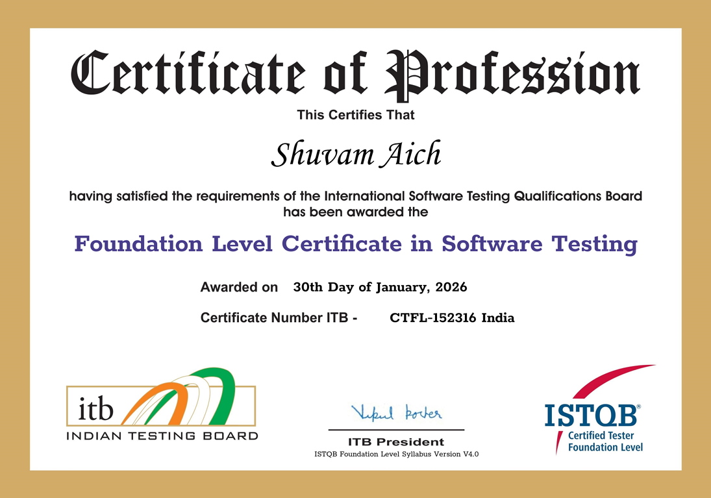

 
Shuvam has completed the ISTQB CTFL 4.0 certification, acquiring practical knowledge of the fundamental concepts of software testing. This certification has strengthened his understanding of core testing principles and enhanced his ability to apply them effectively in professional environments.

Through this achievement, he has developed competencies relevant to roles such as tester, test analyst, test engineer, and software developer, while also building a foundational understanding that supports collaboration with project managers, quality managers, business analysts, and other stakeholders.

As part of the ISTQB® Certified Tester Scheme, this certification has provided him with a solid foundation in software testing and positioned him to further advance his expertise by pursuing higher-level qualifications such as the Core Advanced Levels, Specialist, and Expert Level certifications.

[Link to Certificate](https://drive.google.com/file/d/1g6o-KFU9juw4zlCPjXh_89n6SQ9BtZcf/view?usp=sharing)
