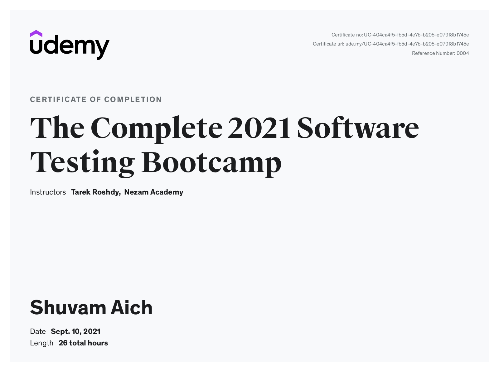

 
Shuvam successfully completed The Complete 2021 Software Testing Bootcamp, a comprehensive program that equipped him with essential skills in software testing methodologies and tools. The course covered manual and automated testing techniques, test planning, bug tracking, and quality assurance best practices. Shuvam gained hands-on experience with popular tools like Selenium, Postman, and JIRA, enabling him to design, execute, and manage test cases effectively. This certification enhanced his ability to ensure software quality and reliability, strengthening his expertise in delivering robust and error-free applications.

[Link to Certificate](https://www.udemy.com/certificate/UC-404ca4f5-fb5d-4e7b-b205-e079f8b1745e/)
