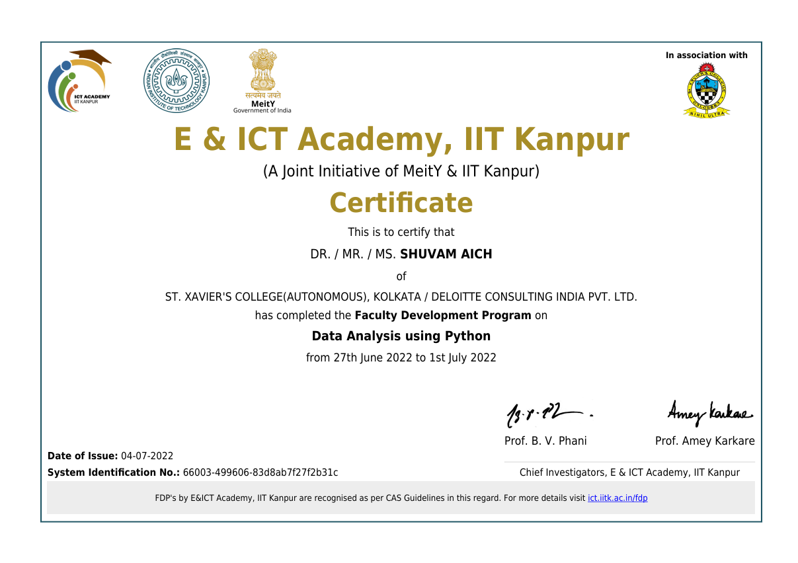

 
Shuvam successfully completed a certification course on Data Analysis with Python, gaining comprehensive knowledge of key concepts such as data wrangling, exploratory data analysis, and data visualization. The course provided hands-on experience with Python libraries like NumPy, Pandas, Matplotlib, and Seaborn, enabling him to analyze, interpret, and visualize data effectively. Through practical projects, Shuvam enhanced his skills in extracting insights from datasets, creating meaningful visual representations, and applying statistical techniques to support data-driven decision-making.

Link: https://ict-certificates.s3.ap-south-1.amazonaws.com/66003-499606-83d8ab7f27f2b31c.pdf?_ga=2.190759211.1080291394.1657373417-693411076.1657373417

