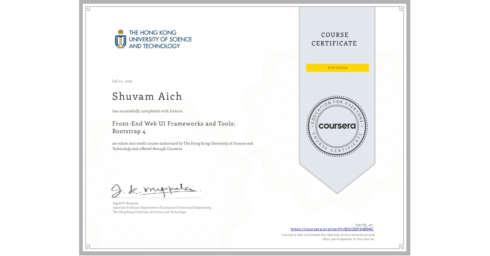

 
Shuvam completed the "Front-End Web UI Frameworks" course on Coursera, gaining practical knowledge of building responsive and mobile-first web applications. The course covered essential features of the Bootstrap framework, including the grid system, navigation components, utilities, and customization options. Through hands-on projects, Shuvam mastered creating dynamic layouts, implementing interactive design elements, and enhancing the user experience. This certification strengthened his web development skills, enabling him to build modern, visually appealing, and responsive websites efficiently.

[Link to Certificate](https://coursera.org/share/62eebb0fb73ab2228117da1bb52a6a28)
