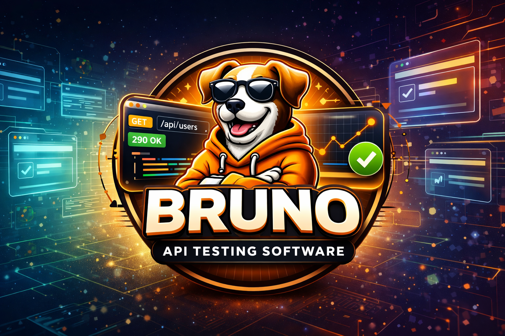

 

<b>Bruno</b> is an open-source API client and testing tool designed for teams that want fast, scriptable, and version-controlled API workflows. Unlike browser-first automation tools, Bruno focuses on HTTP APIs and stores collections as plain files, making it easy to review, maintain, and collaborate through Git.

In this project, I use Bruno to automate REST API scenarios such as authentication flows, request chaining, environment-based execution, and response validation. The goal is to build reliable API checks that are easy to run locally and integrate into continuous integration pipelines.

## Key Highlights

- Collection-driven API tests using Bruno request files
- Reusable environments for dev/test/prod configurations
- Assertion-based validation for status, schema, and business rules
- Practical workflows for debugging and maintaining API contracts

## Bruno vs Postman

### Similarities

- Both support REST API request creation, execution, and response validation.
- Both provide environment variables for running the same requests across dev/test/prod.
- Both can organize requests into collections for structured API workflows.
- Both are useful for manual API debugging and automated regression checks.

### Differences

- Bruno is file-based and Git-friendly by design, while Postman traditionally uses a cloud/workspace-first model.
- Bruno keeps request definitions as plain text files in the repository, making code reviews and diffs straightforward.
- Postman offers a more mature built-in UI ecosystem (team collaboration, monitors, mock servers, documentation tools).
- Bruno is lightweight and developer-centric for local-first workflows; Postman is often preferred for broader cross-team collaboration.

Find more about it at [Github/ShuvamAich - Bruno Experiments](https://github.com/ShuvamAich/Bruno_API_Tests)