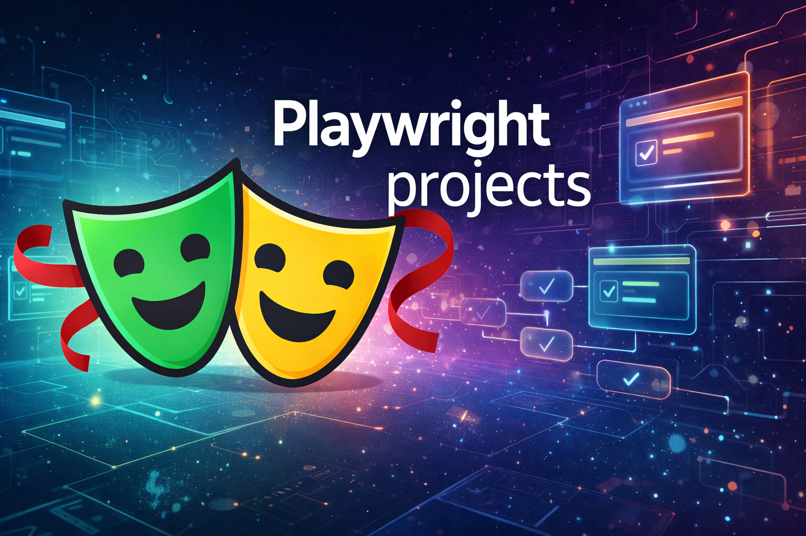

 

<b>Playwright</b> is an open-source end-to-end testing framework by Microsoft that lets you automate modern web applications across Chromium, Firefox, and WebKit with one API. It supports reliable cross-browser testing, fast parallel execution, and built-in features like auto-waiting, tracing, screenshots, and video recording to simplify debugging. It is widely used for UI testing, API testing, and continuous integration workflows.

## Projects
Explore the different branches to find various Playwright projects and experiments!

- Heroku MFA automation Branch: Automate-MFA
- Mailosaur Email Automation Branch: Automate-Mail

### Next in Pipeline:

- SMS OTP MFA automation
- Save and reuse authentication state - Storage State

 
Find more about it at [Github/ShuvamAich - Playwright Experiments](https://github.com/ShuvamAich/PlaywrightExperiments)